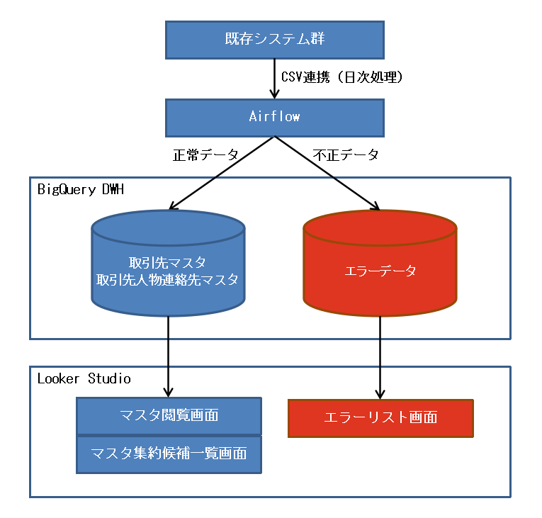
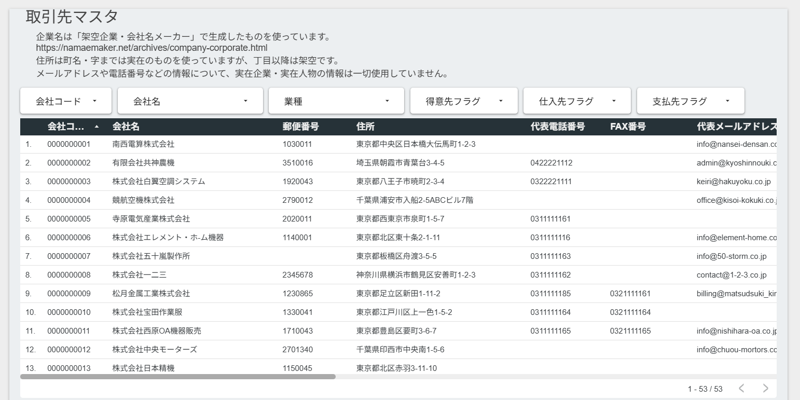
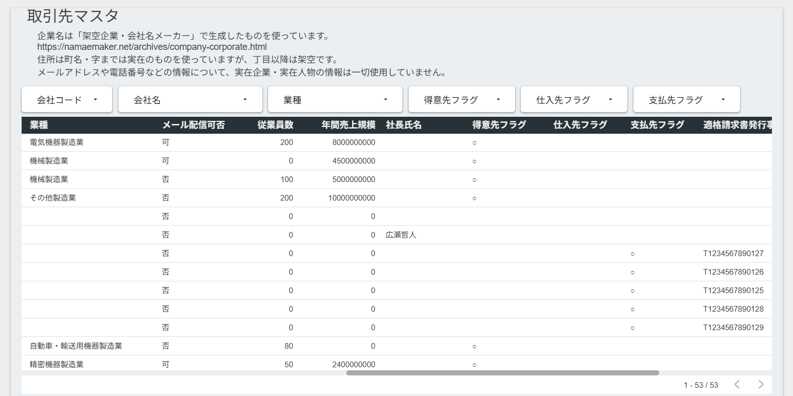
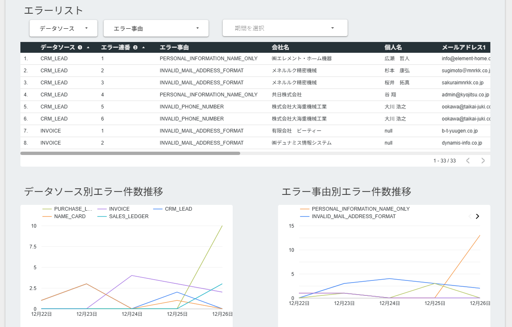
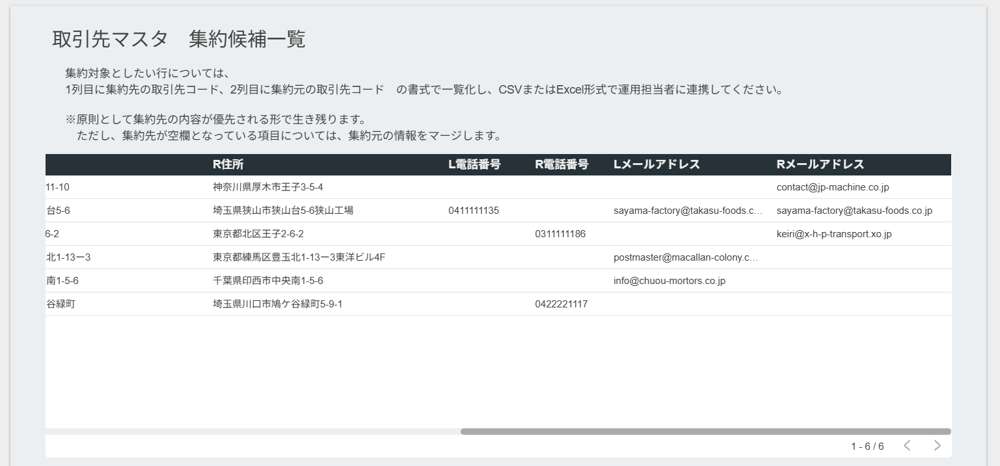

# ポートフォリオ用ETLパイプライン
BigQuery / Airflow / Looker Studio を用いて、複数システムに分散した取引先情報を名寄せ・統合するETLパイプラインのポートフォリオです。  
（モダンスタック技術を使いこなす事よりも、業務システムにおける「安定稼働」「データ品質」「運用を前提とした設計」を重視したETL構成を示すことを目的としています）

## プロジェクト概要

本プロジェクトは、**複数システムに分散して管理されている取引先情報・取引先人物の連絡先情報を統合・名寄せし、最新情報を一元管理するETLパイプライン**を想定したポートフォリオです。

既存の各システムにおいて、取引先情報や取引先人物の連絡先情報が個別に管理されており、  
- どの情報が最新か判断しづらい  
- データの精度や粒度がシステムごと、入力したユーザごとに異なる  

といった課題が存在する状況をシミュレーションしています。

前提として、機械的な名寄せでは100%の精度は出せないという考えの下、  
データ品質に責任を持つべき業務部門が自律的に誤りを是正できる運用を目指し、  
人間の判断を介在させてデータ品質を高めていく思想で設計しています。

本パイプラインでは、各システムの既存インタフェースファイル(CSV)を入力データとして取り込み、  
名寄せ・統合処理を行った上で、以下のマスタに連携します。

- 取引先マスタ  
- 取引先人物連絡先マスタ  

これにより、**最新かつ信頼できる取引先情報の一元化**を実現することを目的としています。

## 全体アーキテクチャ構成

既存システムは5システム存在する事を想定し、フォーマットがそれぞれ異なるCSVファイルを出力する前提です。  
Airflowは日次バッチとして、CSVの取り込み、バリデーション、全角半角などの表記ブレの正規化、名寄せ、BigQueryへの格納を制御します。

BigQuery上では、  
- 正常データは一元化されたマスタ情報としてマスタテーブルに格納されます。  
- 不正データはエラー事由を付加してエラーテーブルに保存され、上流システム側でのデータ是正を促す用途で保管されます。

Looker Studioは上記のデータを以下の視点から閲覧可能です。  
- 各マスタ情報およびエラーリスト  
- 取引先集約候補一覧（取引先マスタ上で、社名が異なるが住所が同一などのデータを抽出）  
- エラー事由ごとおよび既存システムごとのエラー件数推移

また付随機能として、取引先集約（手動名寄せ）バッチが存在しますが、
主要ETLフローへの影響が小さいため本構成図には含めていません。  
必要に応じて手動で名寄せ候補を集約し、マスタ精度を向上させる運用を想定しています。

## 技術スタック

本プロジェクトでは、以下の技術を採用しています。

- **BigQuery**  
  想定するデータ量を扱うには事実上無料で利用可能、かつ後述のLooker Studioとの連携が容易なため採用しました。  
  データの集約・名寄せ後のマスタ格納、および処理途中のテンポラリデータの格納に使用します。

- **Looker Studio**  
  BigQuery上のデータを容易に公開・共有できるため採用しました。  
  ダッシュボード作成やエラーリスト確認など、分析・運用の確認用途に使用します。

- **Airflow（Standalone版）**  
  GCPのCloud Composerを使うことも可能ですが、無料プランがないため今回は見送りました。  
  コードをGitHubで公開する形を想定し、standalone版を使用しています。  
  CSV取り込みからデータ格納までのETL処理を制御します。

## データセットの前提・構造

本ETLパイプラインでは、5件の既存システムから出力されるCSVファイルを取り込みます。  
名寄せに利用する項目は、名称（個人名・会社名）・住所・電話番号・メールアドレスです。  
各システムのCSVファイルでは、列名や書式がそれぞれ異なること、表記揺れや入力のばらつきにより粒度が不統一であることを前提としています。

取り込み時に全角半角や表記揺れの正規化を行い、BigQueryに格納します。  
欠損値やエラー値は別途エラーテーブルに保管されます。

## 名寄せロジック

本ETLパイプラインの機械的な名寄せは、以下の情報のうち **2項目が完全一致** したものを同一会社（同一人物）とみなして集約しています。

- **取引先マスタ**：会社名、住所、代表電話番号、代表メールアドレス  
- **取引先人物連絡先マスタ**：氏名、電話番号、メールアドレス

この際、完全一致判定の前に正規化処理を行うことで精度を高めています。  
例：`（株）` → `株式会社`、全角半角統一など

　※機械的な名寄せでは100%正確にはできないという前提の下、人間系の判断で手動名寄せを行う機能、およびその候補を抽出する「取引先マスタ集約候補一覧画面」を併せて作成しています。

## テーブル設計

本ETLパイプラインでは、BigQuery上に以下のテーブルを作成しています。

### 取引先マスタテーブル
- **用途**：各システムから集約した会社情報の一元管理
- **主なカラム**
  - `company_code`（文字列）：当マスタ上で新規採番されたキー情報
  - `company_name`（文字列）：会社名
  - `full_address`（文字列）：都道府県から建物名までの住所
  - `main_phone_number`（文字列）：代表電話番号
  - `main_email_address`（文字列）：代表メールアドレス
  - `updated_datetime`（日時）：最終更新日時
- **備考**：正規化・名寄せ済み。エラー値は別テーブルに保管

### 取引先人物連絡先マスタテーブル
- **用途**：各システムから集約した取引先人物の連絡先管理
- **主なカラム**
  - `person_id`（文字列）：当マスタ上で新規採番されたキー情報
  - `name`（文字列）：氏名
  - `company_code`（文字列）：取引先マスタとの紐付け
  - `phone_number`（文字列）：電話番号
  - `email_address`（文字列）：メールアドレス
  - `updated_datetime`（日時）：最終更新日時
- **備考**：正規化・名寄せ済み。エラー値は別テーブルに保管

### エラーテーブル（CSVファイル形式ごとに存在）
- **用途**：CSV取り込み後、バリデーション処理で不正と判定されたデータの一覧
- **主なカラム**
  - `error_seq`：同一データソース内で発生したエラーのユニーク連番
  - `error_reason`：エラー理由
  - `updated_datetime`（日時）：最終更新日時
  - 他、元データの内容も併せて格納
- **備考**：運用担当者がデータ修正・再処理するために参照する想定（BI画面では全形式を統合して一括表示）

※なお、データ処理過程用に下記のテーブルも存在しますが、README上では割愛します。  
- CSV取り込み用のデータレイク
- 必要項目抽出用ワークテーブル
- 正規化済み情報テーブル
- UPDATE用テンポラリテーブル

　詳細な構造は別途設計書（[docs/tables.xlsx](docs/tables.xlsx)）をご参照ください。

## DAGの説明

本ETLパイプラインは、Airflowで日次バッチとして実行し、以下の処理フローを順次実行します。

### 主な処理フロー
1. **CSV取り込み**  
   各システムから出力された（想定の）CSVファイルを読み込み、データレイクテーブルに格納します。
2. **ワークテーブル登録**  
   データレイクテーブルから当日連携されたデータを抽出し、必要な項目だけに絞り込んでワークテーブルへ登録します。
3. **バリデーション**  
   ワークテーブルに格納されたデータのうち、欠損値、桁異常などの誤りがあるものをエラーテーブルに移します。
4. **正規化**    
   ワークテーブルのデータに対し、半角全角統一や`（株）` → `株式会社`などの変換を行い、正規化済みデータテーブルに格納します。
5. **マスタ統合・登録**  
   正規化済みデータを基に集約して、取引先マスタ・取引先人物連絡先マスタへの登録・更新を行います。

### スケジュール・リトライ
- **実行スケジュール**：毎日 22:00 に自動実行  
  ※ BigQuery（UTC基準）とJSTの時差による日付跨ぎを考慮し、
    「当日登録データ」を正しく処理できる時刻に設定しています。

- **リトライ方針**：
  - エラー発生時は上流システム側で修正後、翌日の連携データで再処理
  - 現状、Airflowからの自動通知は無し（UIで目視確認）

### 備考
- DAG内のタスクは依存関係に基づき順次実行されます。  

### コード
- 個別タスクの詳細やAirflowコードは[GitHubリポジトリ](https://github.com/masahiro-nakamura-etl/etl-portfolio/tree/main/dags)で確認できます。

dags  
├─[m_company_person_register.py](https://github.com/masahiro-nakamura-etl/etl-portfolio/blob/main/dags/m_company_person_register.py) メインのETL処理のDAG  
├─[m_company_aggregation.py](https://github.com/masahiro-nakamura-etl/etl-portfolio/blob/main/dags/m_company_aggregation.py)     付随機能（取引先マスタ集約）のDAG  
│  
├─bizlogic         上流システム別の処理ロジック  
│ 　├─[common.py](https://github.com/masahiro-nakamura-etl/etl-portfolio/blob/main/dags/bizlogic/common.py)      各ロジック共通機能  
│ 　├─[crm.py](https://github.com/masahiro-nakamura-etl/etl-portfolio/blob/main/dags/bizlogic/crm.py)         営業支援・顧客管理システム由来のデータに関するロジック  
│ 　├─[invoice.py](https://github.com/masahiro-nakamura-etl/etl-portfolio/blob/main/dags/bizlogic/invoice.py)     請求書管理システム由来のデータに関するロジック  
│ 　├─[name_card.py](https://github.com/masahiro-nakamura-etl/etl-portfolio/blob/main/dags/bizlogic/name_card.py)   名刺管理ソフト由来のデータに関するロジック  
│ 　├─[purchase.py](https://github.com/masahiro-nakamura-etl/etl-portfolio/blob/main/dags/bizlogic/purchase.py)    会計システム・仕入帳簿由来のデータに関するロジック  
│ 　├─[sales.py](https://github.com/masahiro-nakamura-etl/etl-portfolio/blob/main/dags/bizlogic/sales.py)       会計システム・売上帳簿由来のデータに関するロジック  
│ 　└─[aggregation.py](https://github.com/masahiro-nakamura-etl/etl-portfolio/blob/main/dags/bizlogic/aggregation.py) 付随機能（取引先マスタ集約）のロジック  
│  
└─common                 共通機能全般  
　　├─[bigquery_access.py](https://github.com/masahiro-nakamura-etl/etl-portfolio/blob/main/dags/common/bigquery_access.py)   BigQueryに対するDAO  
　　├─[name_collection.py](https://github.com/masahiro-nakamura-etl/etl-portfolio/blob/main/dags/common/name_collection.py)   名寄せロジック  
　　├─[utils.py](https://github.com/masahiro-nakamura-etl/etl-portfolio/blob/main/dags/common/utils.py)             文字列操作などの汎用的な機能  
　　└─[validation.py](https://github.com/masahiro-nakamura-etl/etl-portfolio/blob/main/dags/common/validation.py)        バリデーションロジック  

## BIダッシュボードの画面
[こちら](https://lookerstudio.google.com/reporting/e2a32062-11c4-4aaa-9b98-913d09e89180/page/T8EjF)から画面を閲覧できます。  

### マスタ画面
各システムからの情報を集約して表示します。フィルタ機能を備えています。  
取引先マスタ、取引先人物連絡先マスタの2種類があり、画面構成はほぼ同一です。

### エラーリスト画面
バリデーションの際にエラーを検出したデータが格納されます。  
（連携元システム側でのデータ修正を促す意味で一覧化しています）  
また、連携元システムごと、エラー事由ごとの発生件数推移をグラフ化しており、連携元システム側のデータ品質の改善・悪化を可視化してあります。

### 取引先マスタ集約候補一覧画面
機械的な名寄せの対象にはならなかったものの、
- 社名が類似している（"株式会社"の有無のみの差、など）
- 社名は異なるが住所が一致している（社名変更を想定）
- 代表メールアドレスのドメイン部分が完全一致している  

などの条件に該当する取引先を一覧化しています。  
（実運用としては、抽出された候補について経緯を知っている担当者に確認の上、運用担当者が集約操作を行うことを想定しています）  

## 課題事項・今後の改善点
本ETLパイプラインでは、以下の課題や改善余地があると認識しています。

- **取引先人物連絡先マスタの手動集約機能が未対応**  
  氏名・電話番号・メールアドレスは比較的表記揺れが少ないと判断し、
  優先度：低と考え、現状としては実装していません。  
  ただ、将来的には手動集約機能の追加が必要であると考えています。

- **機械的な名寄せ精度の向上**  
  現在は複数項目の完全一致による判定ですが、
  スコアリング方式などを導入することで、より柔軟な名寄せが可能と考えています。

- **非Null値が衝突した場合の優先度判定**  
  例：兼務の人物において、名刺管理ソフトとCRMで役職情報が異なる場合など、
  情報の信頼度や更新日時を考慮した優先順位ルールを設ける方がより好ましいと考えます。

- **コードの再利用性**  
  現在は可読性を重視した実装となっていますが、
  共通処理の抽象化やライブラリ化による再利用性向上の余地があります。

- **データソース追加時のスケーラビリティ**  
  取込元のデータソースが増えるたびにテーブル追加が必要な構成のため、
  長期的な運用にあたっては、メタデータ駆動や設定ファイル化による拡張性向上を検討する必要があります。　　

※実案件では、業務要件・運用体制・コスト制約に応じて、
これらの改善点の優先順位を関係者と協議しながら決定する想定です。　

---

作成日：2025-12-31  
作成者：中村 将大